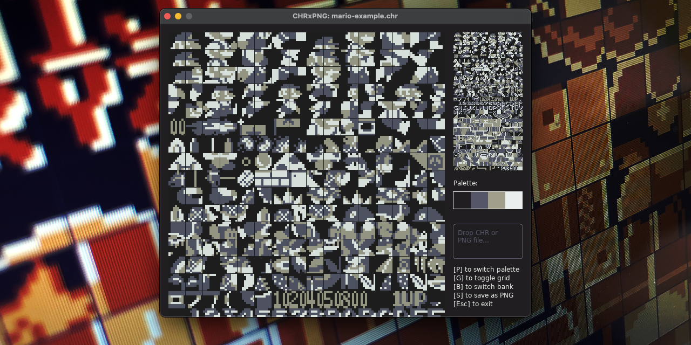
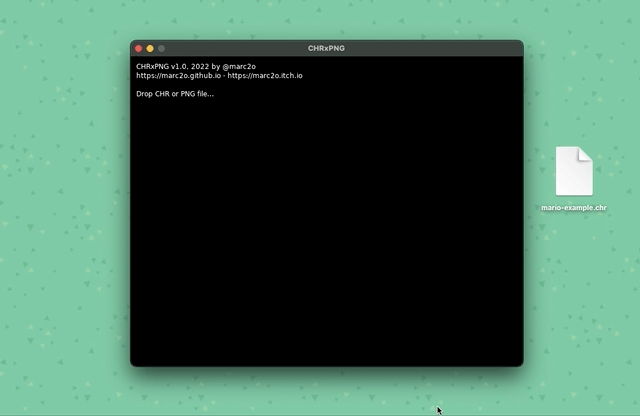

# CHRxPNG

## View and convert NES CHR files to PNG images and vice versa

Use your favorite sprite & tile sheet graphics tool such as  [GrafX2](https://pulkomandy.tk/projects/GrafX2) (which is mine for this task) and create the CHR files necessary for NES development. Or create nice and colorful PNGs from CHR files.

## How to use

Just drag and drop your CHR or PNG file — either into the window or onto the app icon (you probably have to hold down [alt] and [cmd] while doing the latter).

PNG images are expected to be 128 pixels wide and either 128 or 256 pixel high. If more than 4 colors are used in the image, CHRxPNG will tell you. But the PNG does not have to be 2-bit. Anything will do as long as only 4 colors are used.

CHRs can be either 4.096 or 8.192 bytes (actually, they can be any size, but these are the two sizes most suitable for me.)

## Functions

Apart from opening a file CHRxPNG is totally controlled by key commands.

- **Opening a file** Drag and drop a CHR or PNG file into the window (or onto the app icon while holding [alt] + [cmd] keys).
- **[B]** Switch bank (only available if more than one bank is needed to display the CHR or PNG)
- **[G]** Turn tile grid on and off
- **[P]** Switch palettes; there are nine 4-color palettes to cycle through (only available for CHR files)
- **[S]** Save as PNG or CHR (depending on the current type of file) to the folder specified in the dialog box (either `~/Library/Application Support/LOVE/CHRxPNG` on macOS or `%appdata%\LOVE\CHRxPNG` on a Windows machine)
- **[Esc]** Exit CHRxPNG

## Built-in Palettes

CHR tile sets can be viewed with different 4-color palettes. When loading a PNG the corresponding image colors are used and cannot be changed. However, the palette chosen for a CHR is saved when exporting to PNG.

The palettes for coloring the CHR files are the following:

- [2-Bit Grayscale](https://lospec.com/palette-list/2-bit-grayscale)
- [Kirokaze Gameboy](https://lospec.com/palette-list/kirokaze-gameboy)
- [2Bit Demichrome](https://lospec.com/palette-list/2bit-demichrome)
- [Nintendo Super Gameboy](https://lospec.com/palette-list/nintendo-super-gameboy)
- [Nintendo Gameboy BGB](https://lospec.com/palette-list/nintendo-gameboy-bgb)
- [Pokémon SGB](https://lospec.com/palette-list/pokemon-sgb)
- [CGA Palette 1 High](https://lospec.com/palette-list/cga-palette-1-high)
- [Kid Icarus SGB](https://lospec.com/palette-list/kid-icarus-sgb)
- [Super Mario Land 2 SGB](https://lospec.com/palette-list/super-mario-land-2-sgb)

## But, why…?

I needed something sweet and simple to view and convert CHRs. And something that is able to work with 8-Bit PNGs, too. So I coded my own tool. It is made with [LOVE](https://love2d.org) and it does the job quite nicely. It also features several beautiful 4-color palettes from [Lospec](https://lospec.com).

--

2022 by Marc Oliver Orth | @marc2o

[https://marc2o.github.io](https://marc2o.github.io)